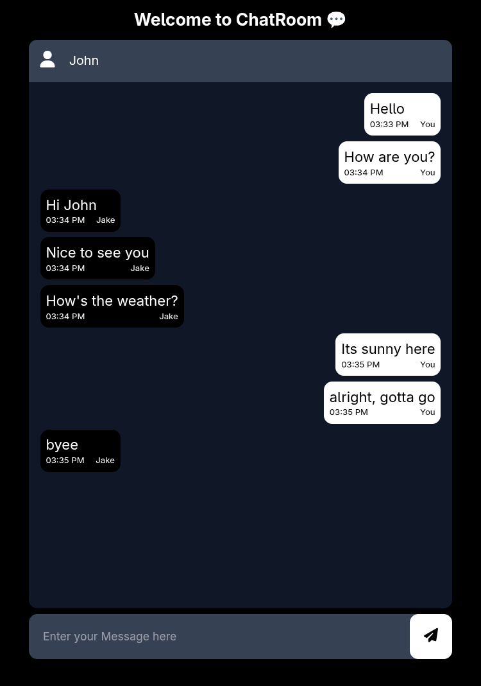
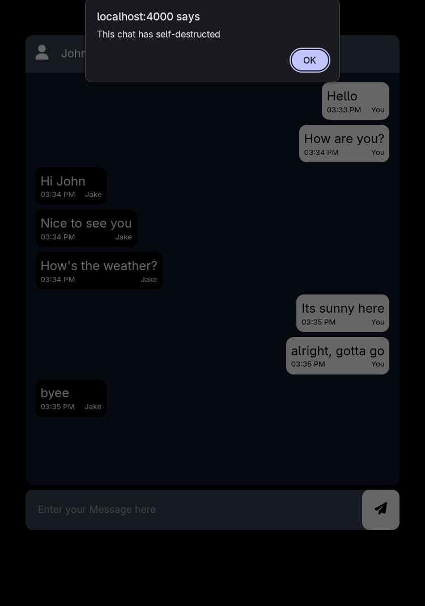

# ChatRoom

A real-time, privacy-focused chat room web application that **self-destructs after X minutes**.  
Built with **Node.js**, **Express**, **Socket.IO**, and **Tailwind CSS**.

No accounts. No history. Just chat.

## ✨ Features

- ⚡ **Real-time messaging** using Socket.IO
- ⏳ **Auto-destruction** after a 3 minutes (Can be changed in the code)
- 🎨 **Responsive UI** styled with Tailwind CSS
- 🚀 **Fast & lightweight** Express backend
- 🧹 Automatic cleanup of rooms and connections

## 🛠️ Tech Stack

- **Backend:** Node.js, Express
- **Realtime:** Socket.IO
- **Frontend:** HTML, Tailwind CSS
- **Runtime:** JavaScript (ES6+)

## 📸 Screenshots

<p>
  
  
</p>


## 📦 Installation

Clone the repository:

```bash
git clone https://github.com/shalinv/ChatRoom.git
cd ChatRoom
```

Install Dependencies:
```bash
npm install
```

Start the server:
```bash
node server.js
```

Open in browser:
```bash
http://localhost:4000
```
